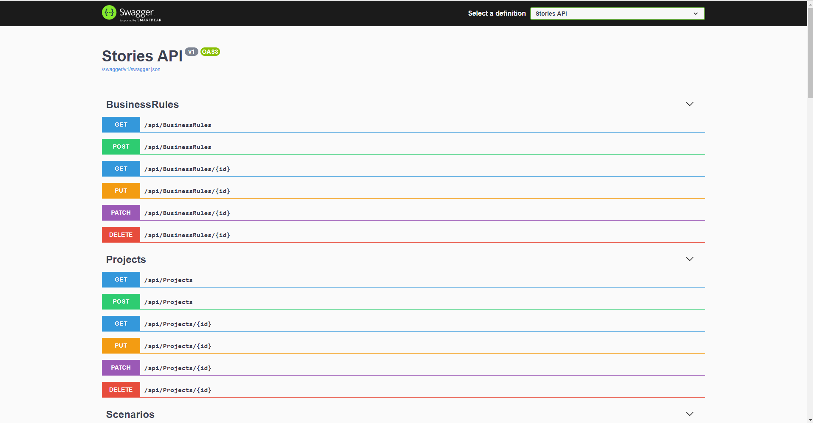
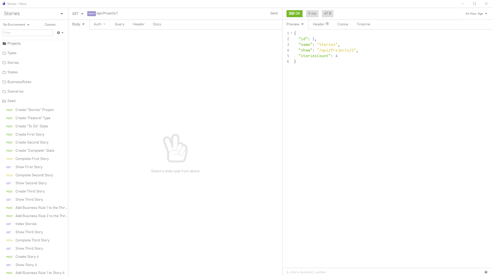

# Stories

Stories is a C# built on .NET Core 3.1 and the Microsoft Entity Framework Core.

It allows to create and manage UserStories based on this :
https://blog.myagilepartner.fr/index.php/2017/03/18/story-a4/

Every Story belongs to a Project, and :

- Belongs to a State (e.g. `To Do`, `Doing`, `Done`, ...)
- Belongs to a Type (e.g. `Feature`, `Bug`, `Technical`, ...)
- Has Many Business Rules
- Has Many test Scenarios

## Get started

Clone the project anywhere is suitable for you on your machine,
open it in your favorite C# IDE.

- Then start `docker-compose up -d` (You must have docker installed on your machine)
- A new database on PostgreSQL is created inside docker, accessible on `localhost` on port `3210`
- Then run `dotnet ef database update` (If you do not have `dotnet ef`, have a look at : https://docs.microsoft.com/en-us/ef/core/miscellaneous/cli/dotnet)
- This will migrate the PostgreSQL `Stories` database, and create the project's tables, columns and foreign keys.
- Then `Build` and `Run` the project with `dotnet` or your C# IDE (I personally use JetBrains Rider but Visual Studio is free and good as well)

## Use your API

There's a Swagger UI Documentation inside the project, once the projects is run,
you may access it via :
- https://localhost:5001/swagger

You may also test the API on `Insomnia` importing the [Insomia v4 Json](./Insomnia.json) file inside
your software. This will create a `Stories` workspace on Insomnia with all endpoints
and some Seeding/Testing flows.

That's all for the moment :)

Enjoy :)

## Example of A4 Story

Given we have a Project named `Project` (I know, I have no imagination).
We can add a Story, say `A user can register to Project` to that Project.

- That Story is not started yet thus, has a State of `To Do`.
- That Story is a feature, thus has a Type of `Feature`.
- Then we build a simple description of that Story, say :
    `When a guest goes to /register, they can create an account`.
- We can add testing data like :
    - Given we have an email to register
    - Given we have a password to register
- We now create some business rules : 
    - To be valid, a password must have at least 8 characters
- Add some scenarios :
    -   Given we have a guest, the guest fills the register form with
        valid email and password,
        
        When he hits `Create Account` Button,
        
        Assert that :
        - a new account is created in the database,
        - the guest receives an account activation email
    -   Given we have a guest, the guest fills the register form with
        invalid password
        
        When he hits `Create Account` Button,
        
        Assert that :
        - no account gets created in the database,
        - no mail is sent,
        - an error is sent back to the view with information about the error
    
